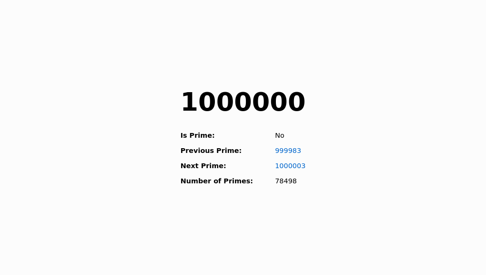

# Primes
An app which uses a sieve to calculate prime numbers.

* Google App Engine Standard Environment (Python 2)
* Cloud Datastore: stores results
* Task Queue: queue for calculations
* webapp2: web framework
* Jinja: HTML templating

